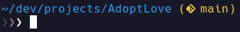
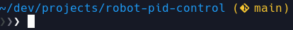
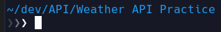
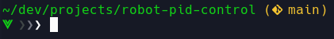
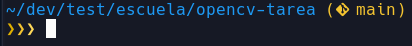
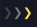
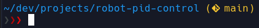
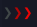

# Morgan Fish Prompt

A clean, minimal and customizable prompt for the Fish shell, designed with a multi-line layout, colored arrows, Python virtual environment detection, Git repository status indicators, and a clean terminal-focused style.

This prompt was built to keep the terminal simple while still showing the information that matters during development.

## Preview

### Default prompt



## Features

- Clean two-line prompt layout
- Current working directory display
- Home directory shortened as `~`
- Git branch detection
- Git status coloring through prompt arrows
- Python virtual environment indicator
- Error status indicator
- Minimal right prompt disabled by default
- Compatible with Fish shell
- Designed to work well with Nerd Fonts

## Prompt Behavior

### Directory and Git branch

The first line shows the current path.

If the current directory is inside a Git repository, the active branch is displayed next to the path.



When no Git repository is detected, only the path is shown.



### Python virtual environment

When a Python virtual environment is active, the prompt changes the path color and displays a virtual environment icon before the arrows.

This makes it easier to notice when a project environment is enabled.



### Git status examples
 


The three arrows change color depending on the current repository state.

| State | Preview | Description |
|---|---|---|
| Clean repository |  | Neutral arrows indicate a clean working tree. |
| Unstaged changes |  | Yellow arrows indicate modified or untracked files that have not been staged. |
| Staged changes |  | Yellow arrows indicate changes that have been staged and are ready to commit. |
| Ahead of upstream |  | The prompt highlights when there are local commits that have not been pushed. |

### Command error status

When the previous command exits with a non-zero status, the prompt changes the arrows to red.



| State | Preview | Description |
|---|---|---|
| Last command failed |  | Red arrows indicate that the previous command exited with an error. |

### Right prompt

This repository also includes an optional right prompt file that disables the Fish right prompt for a cleaner terminal layout.

```fish
function fish_right_prompt
end
```

## Requirements

- Fish shell
- A Nerd Font installed and enabled in your terminal
- Git, for repository status detection

Recommended fonts:

- JetBrainsMono Nerd Font
- FiraCode Nerd Font
- Hack Nerd Font
- MesloLGS Nerd Font

Without a Nerd Font, some icons may not display correctly in the terminal.

## Installation

Clone the repository:

```bash
git clone git@github.com:xJosephMorganx/morgan-fish-prompt.git
cd morgan-fish-prompt
```

Copy the prompt files into your Fish functions directory:

```bash
mkdir -p ~/.config/fish/functions
cp functions/fish_prompt.fish ~/.config/fish/functions/
cp functions/fish_right_prompt.fish ~/.config/fish/functions/
```

Reload Fish:

```bash
exec fish
```

Or simply close and reopen your terminal.

## File Structure

```text
morgan-fish-prompt/
├── assets/
│   └── images/
│       ├── preview-default.png
│       ├── preview-venv.png
│       ├── git-clean.png
│       ├── git-unstaged.png
│       ├── git-staged.png
│       ├── git-ahead.png
│       └── error-status.png
├── functions/
│   ├── fish_prompt.fish
│   └── fish_right_prompt.fish
├── README.md
└── LICENSE
```

## Customization

You can edit the colors directly inside `functions/fish_prompt.fish`.

Some of the main colors used by the prompt are:

```fish
404747  # dark gray
757782  # medium gray
ffffff  # white
f4c430  # yellow
ffd95a  # light yellow
b30505  # dark red
eb0505  # bright red
```

For example, to change the default path color, edit this section:

```fish
if test $in_venv -eq 1
    set_color green
else
    set_color blue
end
```

## Notes

This prompt is intentionally simple and focused. It does not try to display too much information at once. Instead, it highlights the most useful development states:

- where you are
- which Git branch you are on
- whether your repository has changes
- whether you are inside a Python virtual environment
- whether the last command failed

## License

This project is licensed under the MIT License.